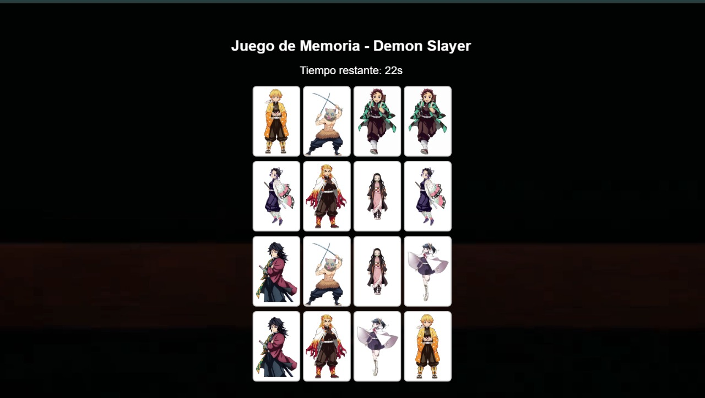
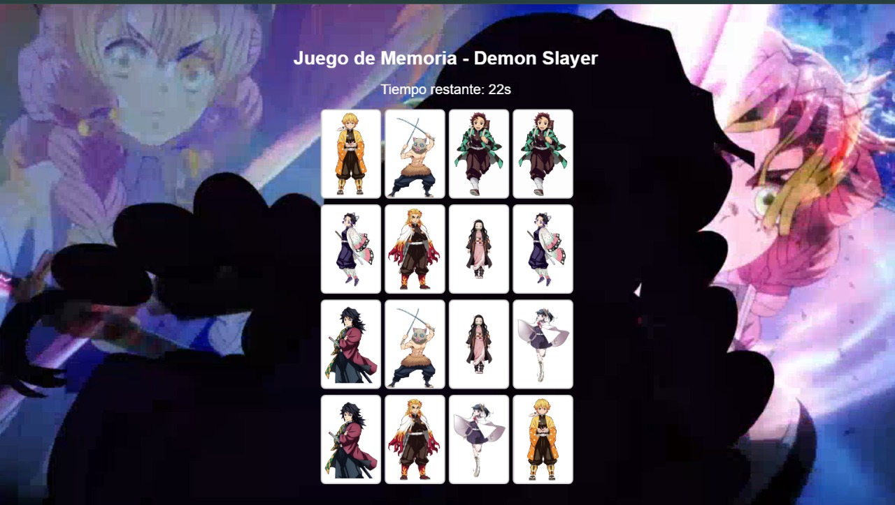
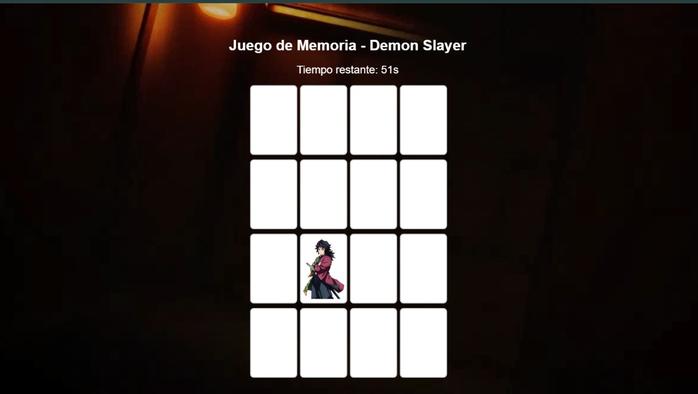
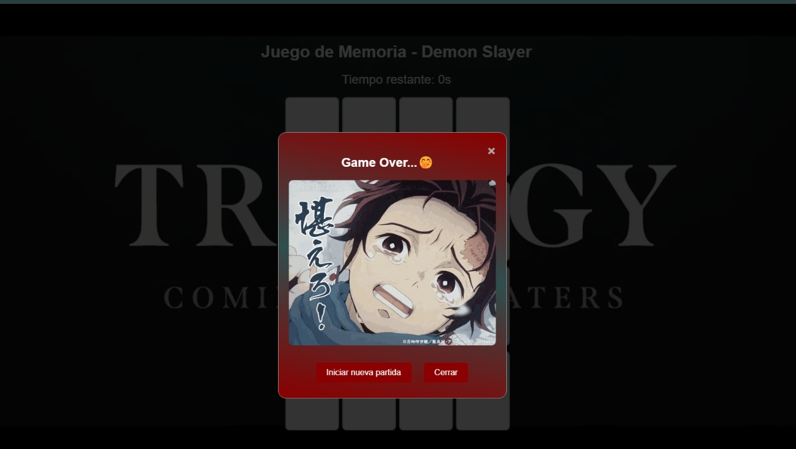

# Juego de Memoria - Demon Slayer

¡Hola! 👋 Gracias por visitar este repositorio en mi GitHub. Mi nombre es Juancito Peña, ¡es un gusto tenerte aquí! Puedes descargar o clonar este repositorio, usarlo y compartirlo. Solo asegúrate de darme una estrella ⭐ y mencionarme cuando lo compartas. ¡Muchas gracias! 🚀

## Descripción del Proyecto

Este es un juego de memoria simple basado en los personajes de Demon Slayer. El objetivo del juego es encontrar todos los pares de cartas iguales en un tiempo limitado de 60 segundos. El juego está implementado utilizando HTML, CSS y JavaScript, proporcionando una experiencia visual atractiva con un video de fondo.









## Tecnologías y Recursos Utilizados

- **HTML**: Para la estructura del contenido del juego.
- **CSS**: Para los estilos visuales y la responsividad del diseño.
- **JavaScript**: Para la lógica del juego y la interactividad.
- **Video de Fondo**: Un video de fondo que mejora la estética del juego.

## Estructura del Proyecto

- `index.html`: El punto de entrada del juego que contiene la estructura del HTML.
- `style.css`: El archivo de estilos que define la apariencia del juego.
- `script.js`: El archivo de JavaScript que maneja la lógica del juego.
- `images/`: Carpeta que contiene las imágenes de las cartas y el gif de "Game Over".

## Cómo Jugar

1. Clona el repositorio a tu máquina local.
   ```bash
   git clone https://github.com/tu_usuario/nombre_del_repositorio.git


### Navega al directorio del proyecto.

cd nombre_del_repositorio
Abre el archivo index.html en tu navegador.

### Características
Video de Fondo: Un video de fondo responsivo que se adapta a cualquier tamaño de pantalla.
Temporizador: Un temporizador que cuenta regresivamente desde 60 segundos.
Modal de Game Over: Una ventana modal que aparece cuando se acaba el tiempo, con una animación y opciones para reiniciar el juego o cerrarlo.

### Contribuciones
¡Las contribuciones son bienvenidas! Si deseas contribuir al proyecto, puedes hacerlo de las siguientes maneras:

### Implementar nuevas características: Como niveles de dificultad.
Mejorar la interfaz de usuario: O agregar nuevas animaciones.
Optimizar el código existente: Para un mejor rendimiento.

## Pasos para Contribuir
Haz un fork del repositorio.
Crea una nueva rama para tu característica o corrección de error.
git checkout -b nombre-de-tu-rama

### Realiza tus cambios y haz un commit.
git commit -m "Descripción de tus cambios"
Sube tus cambios a tu fork.
git push origin nombre-de-tu-rama
Abre un Pull Request en GitHub.

### Licencia
Este proyecto está licenciado bajo la Licencia MIT. Puedes ver el archivo de la licencia aquí.

### Apóyanos  

Si te gusta este proyecto, por favor:

## Dale una estrella ⭐️ en GitHub.
Comparte el repositorio con tus amigos y en tus redes sociales.
¡Cualquier apoyo es muy apreciado!

## Contacto
Si tienes alguna pregunta o sugerencia, no dudes en ponerte en contacto conmigo:

1. 🎬 **YouTube**: [@JuancitoPenaV](https://www.youtube.com/@JuancitoPenaV)
2. 👨‍💼 **LinkedIn**: [Juancito Peña](https://www.linkedin.com/in/juancitope%C3%B1a/)
3. 📰 **Blog**: [Adviser Tecnology](https://advisertecnology.com/)
4. 📷 **Instagram**: [@juancito.pena.v](https://www.instagram.com/juancito.pena.v/)
5. 📑 **Facebook**: [Juancito Peña V](https://www.facebook.com/juancito.p.v)
6. 🐦 **Twitter**: [@JuancitoPenaV](https://twitter.com/JuancitoPenaV)
7. 📰 **Blog**: [Adviser Tecnology](https://advisertecnology.com/)

## Comparte el Repositorio
¡Ayúdanos a hacer crecer este proyecto compartiéndolo!
